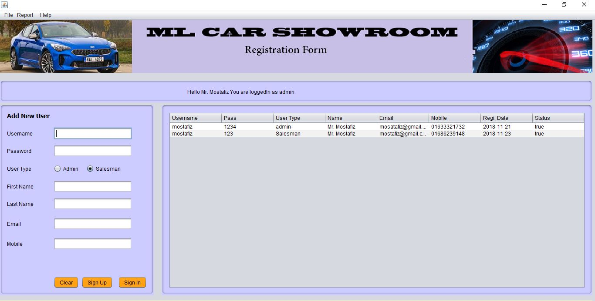
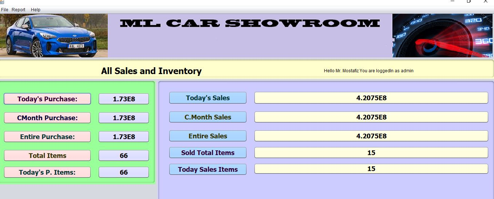
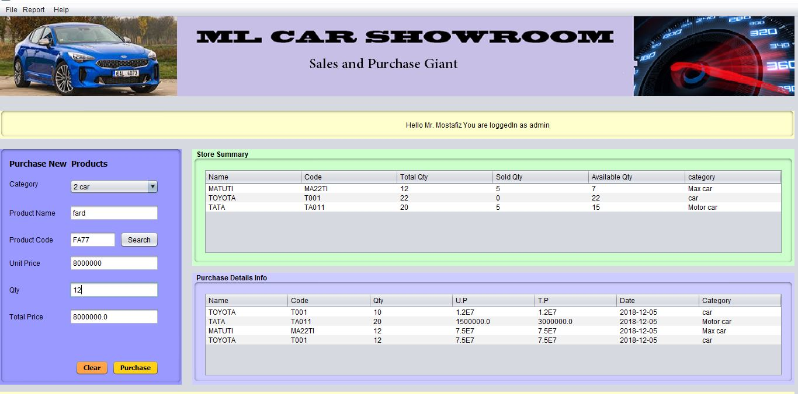
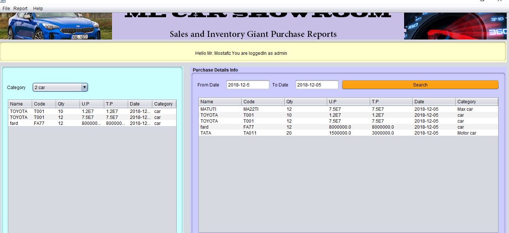
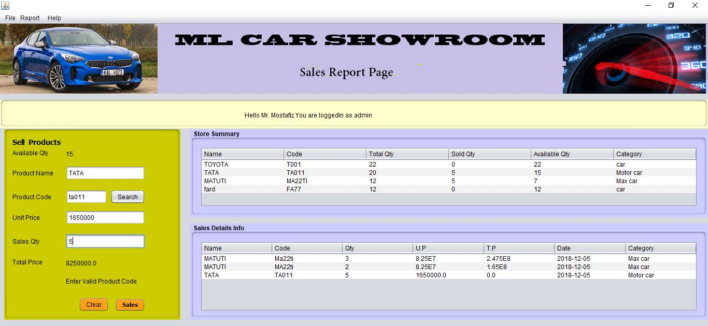
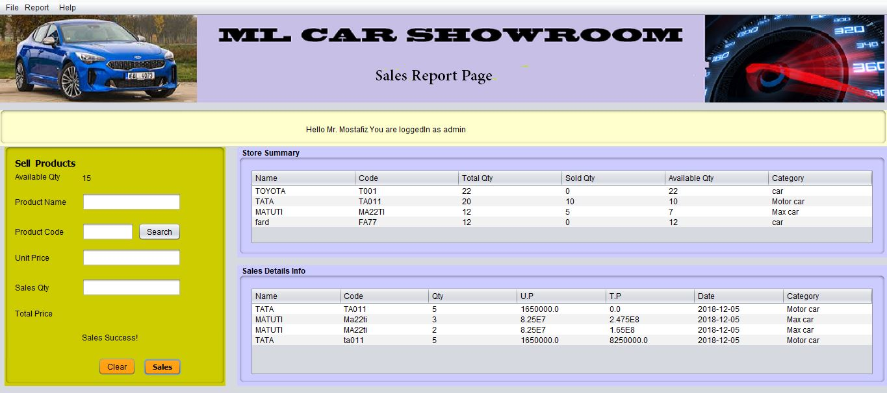

# car_showroom

# Steps of Inventory Calculation:

# Step-1
- Swing 
- MySql

# Step-2

## Domain:
- User
- Purchase
- Sales
- Summary

Advance java, swing 

#Images :

*Login*

*Reg:*

 
*Summary:*

  

*Purchases:*

  

*Purchases:*

  

*Purchases:*

  

*Sales:*

  

*Sales:*

  
